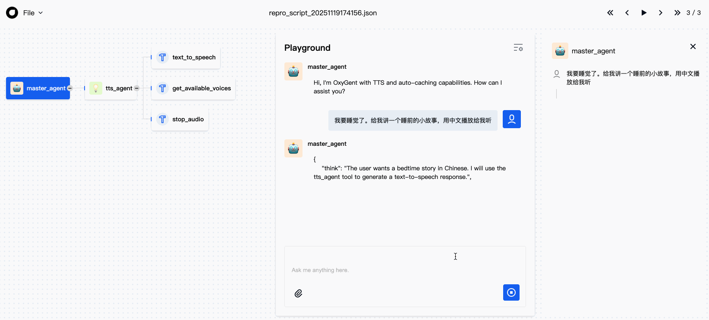

# TTS (Text-to-Speech) Demo

**Source:** `examples/mcp_tools/tts_demo.py`

## Overview

This example demonstrates how to integrate a Text-to-Speech (TTS) MCP service with OxyGent. A `ReActAgent` wraps a custom TTS MCP server powered by Microsoft Edge TTS, providing speech synthesis with automatic caching, intelligent text chunking, and audio playback. A master agent coordinates the TTS agent for multi-task scenarios.



## Prerequisites

- Environment variables: `DEFAULT_LLM_API_KEY`, `DEFAULT_LLM_BASE_URL`, `DEFAULT_LLM_MODEL_NAME`
- Python 3.10+
- OxyGent package installed (`pip install -r requirements.txt`)
- Additional Python packages: `edge-tts`, `pydub`
- Optional: `ffmpeg` installed (for high-quality audio merging)
  - macOS: `brew install ffmpeg`
  - Linux: `apt install ffmpeg`
- Operating system: **macOS or Windows only** (audio playback limitation)
- A `./mcp_servers/tts_tools.py` file (the TTS MCP server)

## How to Run

```bash
python -m examples.mcp_tools.tts_demo
```

The demo starts a web service with a welcome message and TTS capabilities.

## Code Walkthrough

### Configuration

```python
Config.set_agent_llm_model("default_llm")
PROJECT_ROOT = os.path.dirname(os.path.dirname(os.path.dirname(os.path.abspath(__file__))))
TTS_TOOLS_PATH = os.path.join(PROJECT_ROOT, "mcp_servers", "tts_tools.py")
```

Computes the absolute path to the TTS MCP server script by resolving relative to the project root. This ensures the path is correct regardless of the working directory.

### Components (`oxy_space`)

| Component | Type | Role |
|---|---|---|
| `default_llm` | `HttpLLM` | Shared language model |
| `tts_tools` | `StdioMCPClient` | MCP client for the TTS server, using the current Python interpreter (`sys.executable`) |
| `tts_agent` | `ReActAgent` | TTS specialist agent with detailed system prompt about available voices and capabilities |
| `master_agent` | `ReActAgent` | Coordinator agent; `is_master=True`, delegates to `tts_agent` |

### TTS MCP Client

```python
oxy.StdioMCPClient(
    name="tts_tools",
    params={
        "command": sys.executable,
        "args": [TTS_TOOLS_PATH],
    },
)
```

Uses `sys.executable` (the current Python interpreter) to run the TTS MCP server, ensuring it runs in the same virtual environment with all dependencies available.

### TTS Agent System Prompt

The `tts_agent` has a detailed `system_prompt` that documents:

- **Speech Playback**: `text_to_speech(text, voice)` -- converts text to speech and plays it.
- **Audio Control**: `stop_audio()` -- stops current playback; `get_available_voices(language_filter)` -- lists available voices.
- **Key Features**: Automatic caching in `tts_audio_cache/`, fixed 1200-character text chunking, cache reuse for identical text+voice combinations.
- **Popular Voices**: Chinese (XiaoxiaoNeural, YunxiNeural) and English (AriaNeural, GuyNeural).

### Entry Point

```python
async def main():
    async with MAS(oxy_space=oxy_space) as mas:
        await mas.start_web_service(
            first_query="Hello! I'm your TTS assistant...",
            welcome_message="Hi, I'm OxyGent with TTS and auto-caching capabilities...",
        )
```

Starts the web service with both a `first_query` (automatically sent) and a `welcome_message` (displayed in the UI before any interaction).

## Key Concepts

- **StdioMCPClient with `sys.executable`**: Running an MCP server using the same Python interpreter ensures environment consistency. This is a common pattern for Python-based MCP servers.
- **Audio Caching**: The TTS system automatically caches generated audio files, reusing them for identical text+voice combinations to avoid redundant synthesis.
- **Text Chunking**: Long texts are automatically split into 1200-character chunks for processing, then merged for playback.
- **`system_prompt` vs `prompt`**: The `system_prompt` parameter provides role-specific instructions that are separate from the default agent prompt template. It is used here to give the TTS agent detailed knowledge of its tool capabilities.

## Expected Behavior

1. The web UI opens with a welcome message about TTS capabilities.
2. Users can type text and ask the agent to read it aloud.
3. The `master_agent` routes TTS requests to `tts_agent`.
4. The `tts_agent` calls `text_to_speech` on the TTS MCP server.
5. Audio is generated (or served from cache), and playback begins on the host machine.
6. Users can also query available voices or stop playback.

## TTS Tool API Reference

### `text_to_speech(text, voice)`

Converts text to speech and plays it automatically.

- **Parameters:**
  - `text` (str, required): The text content to convert.
  - `voice` (str, optional): Voice ID, defaults to `zh-CN-XiaoxiaoNeural`.
- **Returns:** `"Playing cached audio (voice: xxx)"` or `"Playing generated audio (voice: xxx)"`; error message on failure.

### `get_available_voices(language_filter)`

Queries all voices supported by Edge TTS, with optional language filtering.

- **Parameters:**
  - `language_filter` (str, optional): Language filter such as `zh`, `en`, or `zh-CN`. Omit to return all voices.
- **Returns:** List of available voices (up to 20 shown).

### `stop_audio()`

Stops the currently playing audio.

- **Returns:** `"Audio playback stopped successfully"` or error message.

## Common Voices

| Language | Voice ID | Description | Gender |
|----------|----------|-------------|--------|
| Chinese | `zh-CN-XiaoxiaoNeural` | Xiaoxiao | Female |
| Chinese | `zh-CN-YunxiNeural` | Yunxi | Male |
| Chinese | `zh-CN-YunyangNeural` | Yunyang | Male |
| Chinese | `zh-CN-XiaoyiNeural` | Xiaoyi | Female |
| English | `en-US-AriaNeural` | Aria | Female |
| English | `en-US-GuyNeural` | Guy | Male |
| English | `en-US-JennyNeural` | Jenny | Female |

## Technical Details

### Caching Strategy

- **Cache directory:** `tts_audio_cache/` (under the current working directory)
- **Cache key:** MD5 hash of text content + voice ID
- **Capacity:** Max 50 files; caches older than 7 days are auto-deleted, oldest files removed when limit is exceeded
- **Index file:** `cache_index.json`

### Text Chunking

For texts exceeding 1200 characters, the tool splits intelligently by priority:

1. At sentence-ending punctuation (. ! ? and CJK equivalents)
2. At commas and semicolons
3. Forced split by character count

Minimum chunk size is 50 characters.

### Retry Mechanism

- Up to 3 retries with exponential backoff + random jitter
- Base delay 1 second, max delay 10 seconds

### Audio Merging

For chunked long texts:

- **High-quality mode** (requires ffmpeg/pydub): Merges via pydub with 200ms gaps between chunks
- **Simple mode** (no ffmpeg): Binary concatenation

## Troubleshooting

| Issue | Error Message | Solution |
|-------|---------------|----------|
| Missing dependency | `edge-tts is not installed` | Run `pip install edge-tts` |
| Unsupported OS | `Unsupported system: Linux` | Use macOS or Windows; Linux audio playback is not yet supported |
| Player not found | `afplay command not found` (macOS) or `PowerShell not available` (Windows) | Check system audio settings, restart terminal, or verify PowerShell is installed |
| Cache permissions | `Cannot write to cache directory` | Check `tts_audio_cache/` directory permissions, run `chmod 755 tts_audio_cache/` |
| Network timeout | `Network timeout` | Check network connection; the tool auto-retries 3 times, try again later |
